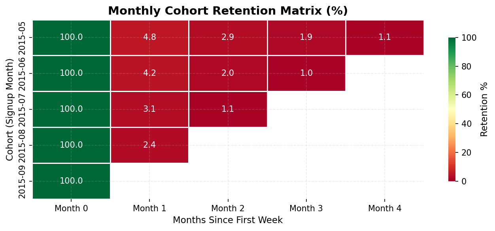
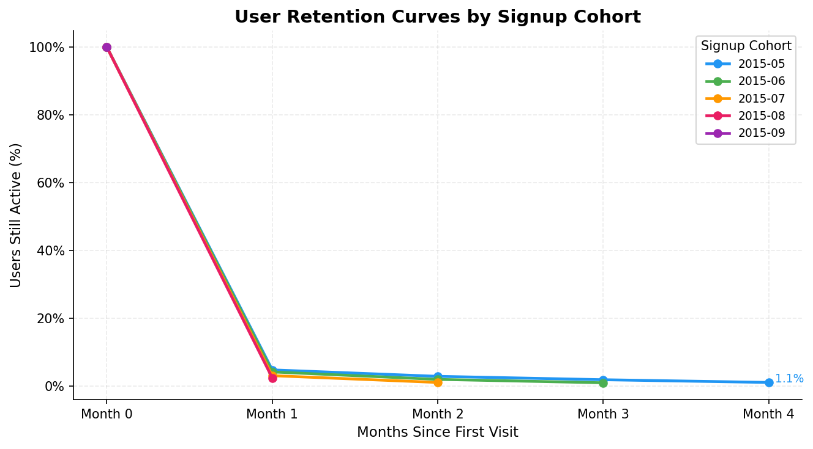
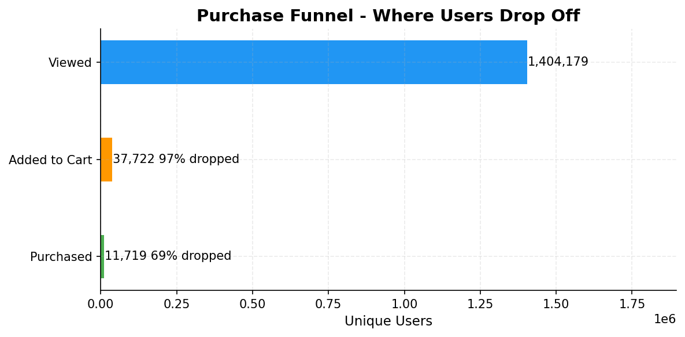
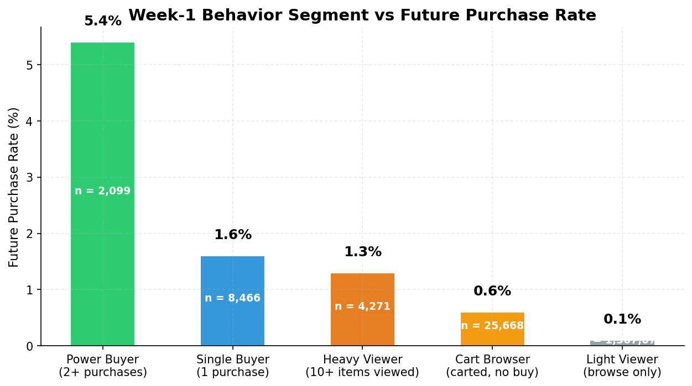

# 🛒 Retail Rocket — User Retention & Churn Analysis


> An end-to-end data analyst project analysing **2.76 million real 
> e-commerce events** to understand user retention, churn behaviour, 
> and purchase funnel drop-off using Python, SQL, and Power BI.

---

## 📌 Table of Contents

- [Project Overview](#project-overview)
- [Business Questions](#business-questions)
- [Dataset](#dataset)
- [Project Structure](#project-structure)
- [Tools & Stack](#tools--stack)
- [Key Findings](#key-findings)
- [Dashboard Preview](#dashboard-preview)
- [Business Recommendations](#business-recommendations)
- [How to Reproduce](#how-to-reproduce)

---

## 🎯 Project Overview

This project simulates the work of a product data analyst at an 
e-commerce company. Starting from raw event logs, I built a full 
analytical pipeline to answer 15 business questions across four 
analytical areas:

- **Retention** — Are users coming back after their first visit?
- **Churn** — Who left and when did they go silent?
- **Funnel** — Where do we lose users in the purchase journey?
- **Behaviour** — What do high-value users do differently in week 1?

---

## ❓ Business Questions

| # | Question | SQL File |
|---|---|---|
| 1 | What % of users return in months 1, 2, 3, 4? | 03_retention_matrix.sql |
| 2 | Which signup cohort has the best month-2 retention? | 03_retention_matrix.sql |
| 3 | Where does the purchase funnel lose the most users? | 04_funnel_analysis.sql |
| 4 | Which item categories have the highest conversion rate? | 04_funnel_analysis.sql |
| 5 | Does conversion vary by day of week? | 04_funnel_analysis.sql |
| 6 | What hour of day drives the most transactions? | 04_funnel_analysis.sql |
| 7 | How are users distributed across churn segments? | 05_churn_flags.sql |
| 8 | When do cart abandoners go silent? | 05_churn_flags.sql |
| 9 | Which week-1 behaviour best predicts future purchase? | 06_power_users.sql |
| 10 | What event threshold separates high vs low retention? | 06_power_users.sql |
| 11 | How many touchpoints before a user first purchases? | 07_business_questions.sql |
| 12 | How fast do users decide after adding to cart? | 07_business_questions.sql |
| 13 | What is the repeat purchase rate? | 07_business_questions.sql |
| 14 | What is the month-over-month growth in users & transactions? | 07_business_questions.sql |
| 15 | What does the 7-day rolling transaction trend show? | 07_business_questions.sql |

---

## 📦 Dataset

**Source:** [Retail Rocket E-commerce Dataset — Kaggle](https://www.kaggle.com/datasets/retailrocket/ecommerce-dataset)

| File | Rows | Description |
|---|---|---|
| `events.csv` | 2,756,101 | User events — view, addtocart, transaction |
| `item_properties_part1.csv` | 2,249,689 | Item metadata — category, price |
| `item_properties_part2.csv` | 2,249,689 | Item metadata continuation |

**Time period:** May 2015 — September 2015 (4.5 months)

**Event breakdown:**
- Views — ~90% of all events
- Add to cart — ~7% of all events
- Transactions — ~3% of all events

> Raw data files are not included in this repository (too large).
> Download from Kaggle and place in the `data/` folder before running.

---

## 📁 Project Structure

```
retail-rocket-retention/
│
├── data/                        ← raw CSVs (git-ignored)
│   ├── events.csv
│   ├── item_properties_part1.csv
│   └── item_properties_part2.csv
│
├── sql/                         ← all SQL analysis files
│   ├── 00_fix_timestamps.sql
│   ├── 01_setup.sql
│   ├── 02_cohort_assignment.sql
│   ├── 03_retention_matrix.sql
│   ├── 04_funnel_analysis.sql
│   ├── 05_churn_flags.sql
│   ├── 06_power_users.sql
│   └── 07_business_questions.sql
│
├── notebooks/                   ← Jupyter notebooks
│   ├── 01_data_loading.ipynb
│   ├── 02_export_for_powerbi.ipynb
│   └── 03_eda_visualizations.ipynb
│
├── outputs/                     ← exported charts + CSVs
│   ├── cohort_heatmap.png
│   ├── retention_curves.png
│   ├── funnel_chart.png
│   ├── segment_conversion.png
│   ├── churn_donut.png
│   ├── rolling_transactions.png
│   └── *.csv
│
├── dashboard/                   ← Power BI files
│   ├── retail_rocket.pbix
│   └── retail_rocket_report.pdf
│
├── .gitignore
└── README.md
```

---

## 🛠️ Tools & Stack

| Layer | Tool | Purpose |
|---|---|---|
| Language | Python 3.10 | Data loading, cleaning, EDA |
| Libraries | pandas, matplotlib, seaborn | Data manipulation and charts |
| Database | SQLite | Storing and querying event data |
| SQL | 7 query files, 15 business questions | All analytical queries |
| Visualisation | Power BI Desktop | Executive dashboard |
| Version control | Git + GitHub | Project management |

---

## 🔑 Key Findings

### 1. Retention Collapses After Month 1
Only **3.6% of users** return in month 1 and **2.0%** in month 2.
The platform fails to create a return habit after the first visit.
The May 2015 cohort showed the best retention at month 2 (2.9%).

### 2. The Funnel Leaks at View → Cart
- **1,404,179** users viewed products
- Only **37,722** (2.7%) added to cart
- Only **11,719** (0.83%) completed a purchase
- The biggest drop is view → cart (97.3% drop-off)
- This indicates a discoverability problem, not a checkout problem

### 3. Week-1 Behaviour Strongly Predicts Future Purchase
- Power buyers (2+ purchases in week 1) convert at **5.4×** the rate of light viewers
- Users with 10+ items viewed in week 1 have **1.3×** higher future purchase rate
- The critical signal: **cart action in week 1** is the strongest predictor of return purchase

### 4. Cart Abandoners Have a 30–44 Day Re-engagement Window
Most churned cart abandoners go silent within **30–44 days** of their last activity.
This is the optimal window for re-engagement campaigns.

### 5. Repeat Purchase Rate is Very Low
- **76.57%** of all users churned without ever purchasing (churned viewer)
- Only a small fraction of buyers ever returned to buy again
- Retaining existing buyers is significantly more valuable than acquiring new ones

---

## 📊 Dashboard Preview









---

## 💡 Business Recommendations

| Finding | Recommendation | Expected Impact |
|---|---|---|
| 97% view→cart drop-off | Add personalised product recommendations on item pages | +15–20% cart rate |
| 68% churn before month 2 | Trigger re-engagement email within 48hrs of first visit | Recover 8–12% of churned viewers |
| Cart abandoners silent at 30–44 days | Send cart reminder at 24hr and 72hr marks | +10–15% cart recovery |
| Power buyers have 5.4× conversion rate | Offer first-purchase incentive to accelerate week-1 buy | Increase LTV segment |
| 0.83% overall conversion | A/B test simplified checkout flow | +0.2–0.5% conversion lift |

---

## ▶️ How to Reproduce

**Requirements:**
```bash
pip install pandas matplotlib seaborn jupyter ipykernel
```

**Steps:**
```bash
# 1. Clone the repo
git clone https://github.com/bhuvancw/retail-rocket-retention
cd retail-rocket-retention

# 2. Download dataset from Kaggle
# → Place all 3 CSV files in data/ folder

# 3. Run SQL fix first (in VS Code with SQLite extension)
# → Open and run sql/00_fix_timestamps.sql

# 4. Run SQL files in order (01 through 07)

# 5. Run notebooks in order
jupyter notebook notebooks/01_data_loading.ipynb
jupyter notebook notebooks/02_export_for_powerbi.ipynb
jupyter notebook notebooks/03_eda_visualizations.ipynb

# 6. Open Power BI dashboard
# → dashboard/retail_rocket.pbix
```

---

## 👤 Author

**Bhuvan Wandkar**  
[LinkedIn](https://linkedin.com/in/bhuvan-wandkar-b53a48266/) · 
[GitHub](https://github.com/bhuvancw)